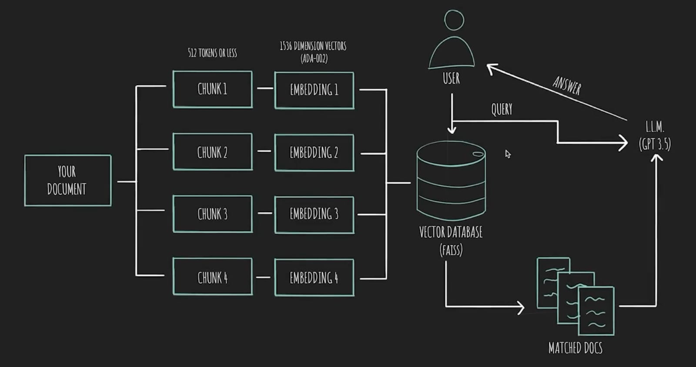

# Chat with PDF using OpenRouter 🤖📄

An intelligent PDF question-answering system that leverages Large Language Models (LLMs) to extract insights from your documents. Upload PDFs, ask questions in natural language, and get accurate answers based on document content.

## Quick Links

- **Live Demo**: [Streamlit App](https://stoicy-ai.streamlit.app/)
- **GitHub Repository**: [View Source Code](https://github.com/Stoic-shree/StoicAI)
- **Video Demo**: [Watch Walkthrough](https://github.com/Stoic-shree/StoicAI/raw/main/Assets/demovideo.mp4) 

---

## Table of Contents

- [Overview](#overview)
- [Features](#features)
- [Limitations](#limitations)
- [Architecture](#architecture)
- [Technology Stack](#technology-stack)
- [Prerequisites](#prerequisites)
- [Installation & Setup](#installation--setup)
- [Running Locally](#running-locally)
- [Usage Guide](#usage-guide)
- [Project Structure](#project-structure)
- [Potential Improvements](#potential-improvements)
- [Contact](#contact)

---

## Overview

This application implements a Retrieval-Augmented Generation (RAG) system that enables users to interact with PDF documents through natural language queries. Instead of manually searching through lengthy documents, users can ask questions and receive contextually relevant answers powered by OpenAI's GPT models.

### What is RAG?

Retrieval-Augmented Generation combines:
1. **Information Retrieval**: Finding relevant document sections using vector similarity search
2. **Language Generation**: Using an LLM to synthesize answers from retrieved context

This approach ensures responses are grounded in your specific documents rather than relying solely on the model's pre-trained knowledge.

---

## Features

- **Multi-PDF Support**: Upload and process multiple PDF files simultaneously
- **Natural Language Queries**: Ask questions in plain English
- **Semantic Search**: Uses vector embeddings for intelligent document search
- **Context-Aware Answers**: Responses are based solely on uploaded documents
- **Fast Processing**: FAISS vector database enables rapid similarity search
- **Secure**: API keys managed through environment variables
- **User-Friendly Interface**: Clean Streamlit UI for easy interaction
- **Persistent Storage**: Processed documents stored locally for quick re-querying
- **Real-Time Processing**: Immediate feedback during document processing

---

## Limitations

- **Internet Dependency**: Requires active internet connection for OpenRouter API access
- **PDF Format Constraints**: May not work optimally with scanned PDFs or image-based documents (no OCR support)
- **Token Limits**: Large documents may exceed model context window limits
- **Single Session**: No conversation history persistence across sessions
- **Index Replacement**: Uploading new PDFs replaces the existing index rather than appending
- **English Optimized**: Best performance with English language documents

---

## Architecture



### System Workflow

The diagram above illustrates the end-to-end flow of the application:

1.  **Input**: Users upload PDF documents via the Streamlit interface.
2.  **Processing**: The system extracts text, splits it into chunks, and generates vector embeddings using OpenAI models.
3.  **Storage**: These embeddings are stored in a local FAISS vector database for efficient retrieval.
4.  **Querying**: When a user asks a question, it is converted into a vector and compared against the stored embeddings to find relevant context.
5.  **Response**: The relevant context and the user's question are sent to the LLM (GPT-4o-mini), which generates an accurate, context-aware answer.

---

## Technology Stack

| Category | Technology | Version | Purpose |
|----------|-----------|---------|---------|
| **AI Model** | OpenAI GPT-4o-mini | Latest | Question answering & text generation |
| **Embeddings** | text-embedding-3-small | Latest | Document vectorization (1536 dims) |
| **Framework** | LangChain | Latest | LLM orchestration & document processing |
| **Vector DB** | FAISS (CPU) | Latest | Fast similarity search & retrieval |
| **UI Framework** | Streamlit | Latest | Web interface & user interaction |
| **API Gateway** | OpenRouter | v1 | Unified access to AI models |
| **PDF Processing** | PyPDF2 | Latest | Text extraction from PDFs |
| **Environment** | python-dotenv | Latest | Secure configuration management |

---

## Prerequisites

- **Python**: 3.8 or higher
- **OpenRouter Account**: [Sign up here](https://openrouter.ai)
- **API Credits**: Ensure your OpenRouter account has sufficient credits
- **Operating System**: Windows, macOS, or Linux
- **RAM**: Minimum 4GB recommended
- **Internet Connection**: Required for API calls

---

## Installation & Setup

### Step 1: Clone the Repository

```bash
git clone https://github.com/Stoic-shree/StoicAI.git
cd StoicAI
```

### Step 2: Create Virtual Environment (Recommended)

```bash
# Create virtual environment
python -m venv venv

# Activate virtual environment
# On Windows:
venv\Scripts\activate
# On macOS/Linux:
source venv/bin/activate
```

### Step 3: Install Dependencies

```bash
pip install -r requirements.txt
```

### Step 4: Configure Environment Variables

Create a `.env` file in the project root:

```bash
# .env
OPENROUTER_API_KEY=your_openrouter_api_key_here
```

**To get your OpenRouter API key:**
1. Visit [OpenRouter](https://openrouter.ai)
2. Sign up or log in
3. Navigate to Keys section
4. Create a new API key
5. Copy and paste into `.env` file

---

## Running Locally

### Start the Application

```bash
streamlit run app.py
```

### Access the Interface

The application will automatically open in your default browser at:
```
http://localhost:8501
```

If it doesn't open automatically, navigate to the URL manually.

### Stop the Application

Press `Ctrl+C` in the terminal to stop the Streamlit server.

---

## Usage Guide

### Step-by-Step Instructions

1. **Launch Application**
   ```bash
   streamlit run app.py
   ```

2. **Upload Documents**
   - Click the sidebar menu
   - Click "Browse files" under "Upload your PDF Files"
   - Select one or multiple PDF files
   - Click "Submit & Process"
   - Wait for "Done" confirmation

3. **Ask Questions**
   - Type your question in the text input field
   - Press Enter or click outside the field
   - View the AI-generated answer below

4. **Process New Documents**
   - Upload new PDFs (this will replace the existing index)
   - Click "Submit & Process" again

---

## Project Structure

```
chat-with-pdf/
│
├── app.py
├── list_models.py
├── requirements.txt
├── .env
├── .gitignore
├── .gitattributes
├── README.md
│
├── faiss_index/
│   ├── index.faiss
│   └── index.pkl
│
└── venv/
```

---

## Potential Improvements

### File Format Support
- **Word Documents**: Add support for `.docx` and `.doc` files
- **Text Files**: Support for `.txt` and `.md` files
- **OCR Integration**: Enable processing of scanned PDFs and images using OCR

### Model & Performance
- **Local LLM Support**: Integration with Ollama or other local models to reduce API costs
- **Model Selection**: Allow users to choose between different AI models
- **Caching**: Implement intelligent caching to reduce redundant API calls
- **Streaming Responses**: Show answers progressively as they're generated

### Features
- **Conversation Memory**: Maintain chat history for follow-up questions
- **Multi-Document Queries**: Ask questions across multiple document sets
- **Source Citations**: Show specific page numbers and excerpts from source documents
- **Export Functionality**: Save conversations and answers as PDF or text

### User Interface
- **Dark Mode**: Add dark theme option
- **Mobile Responsive**: Optimize UI for mobile devices
- **Batch Processing**: Process multiple queries at once
- **Document Preview**: Display PDF preview alongside chat interface

---

## Contact
For any questions, feel free to reach out.